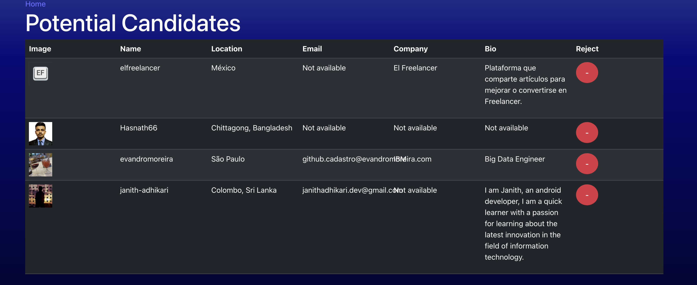

# **Hex Recruit**  

## Description  
Hex Recruit is a React-based web application built with TypeScript that allows employers to search and review potential candidates via the GitHub API. Users can view candidates' details, accept or reject them, and keep track of potential hires. The application features a sleek interface with persistent storage, making it easy to manage and revisit saved candidates.  

## Table of Contents  
- [Features](#features)  
- [Technologies Used](#technologies-used)  
- [Installation](#installation)  
- [Usage](#usage)  
- [Deployment](#deployment)  
- [Contributing](#contributing)  
- [Collaborators](#collaborators)  
- [License](#license)  
- [Questions](#questions)  

## ✨ Features  
✔️ **Search GitHub Users:** Enter a username or search term to find GitHub users.  
✔️ **Display User Information:** View details like username, avatar, profile URL, and additional user stats.  
✔️ **Responsive Design:** Optimized for both desktop and mobile viewing.  
✔️ **Error Handling:** Displays meaningful error messages for failed requests (e.g., unauthorized access, rate limits).  

## 🛠 Technologies Used  
- **Frontend:** React, TypeScript, React Router  
- **API:** GitHub REST API  
- **Styling:** Bootstrap (with customizations), CSS  
- **Build Tools:** Vite  

## 🛠 Installation  

### Prerequisites  
- Node.js and npm installed on your machine  
- A GitHub Personal Access Token with read-only access to public data  

### Steps  

1️⃣ Clone the Repository:  
```bash
git clone https://github.com/yourusername/github-user-search.git
cd github-user-search
```  

2️⃣ Install Dependencies:  
```bash
npm install
```  

3️⃣ Setup the Environment Variables:  
```bash
VITE_GITHUB_TOKEN=your_github_token_here
```  

4️⃣ Run the Application:  
```bash
npm run dev
```  

5️⃣ Build the Application:  
```bash
npm run build
```  

## 🛠 Deployment  
The application is deployed and accessible at:  
[**Live Deployment**](https://hex-recruit.onrender.com)  

## 📸 Screenshot  



## 🚀 Usage  
1. Open your browser and go to `http://localhost:3000`.  
2. Enter a GitHub username in the search bar.  
3. Click **Search** to view the user's GitHub profile information.  

## 🤝 Contributing  
1. **Fork the Repository**  
2. **Create a New Branch:**  
   ```bash
   git checkout -b feature-branch
   ```  
3. **Make your Changes**  
4. **Commit Your Changes:**  
   ```bash
   git commit -m "Add new feature"
   ```  
5. **Push to the branch:**  
   ```bash
   git push origin feature-branch
   ```  
6. **Create a Pull Request**  

## 👥 Collaborators  
- **Martha Watson** (Lead Developer)  
- **Jacob Watson** (Contributor) ([GitHub: JakeStair](https://github.com/JakeStair)) 
- **Justin Moore** (Contributor)

## 📝 License  
This project is licensed under the **MIT License**.  

## ❓ Questions  
If you have any questions about the project, feel free to contact me:  
📌 **GitHub:** [Elementary-my-dear-Watson](https://github.com/Elementary-my-dear-Watson)  
📩 **Email:** [marthacdenzer@gmail.com](mailto:marthacdenzer@gmail.com)  

---

